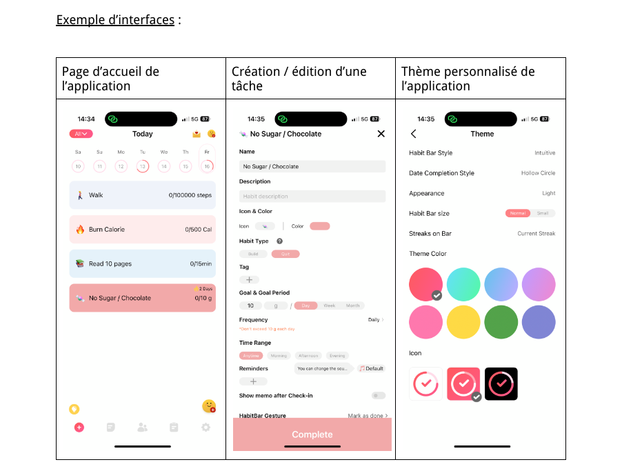

# HabitsTracker

Un tracker d'habitudes pour performer au boulot et dans la vie de tous les jours.

## Contexte

On voit ces derniers temps une émergence de nombreuses applications de suivi d'habitudes sur le marché. Malheureusement, les solutions proposées sont souvent soit trop complexes et encombrées, soit trop basiques et limitées par des modèles de tarification agressive (après tout c’est normal, les gens sont prêts à payer alors pourquoi s’en priver).

Relevons le défi de créer une application qui équilibre parfaitement fonctionnalité et simplicité !

## Objectif principal

L'objectif de ce projet de groupe est de développer une application nommée “**Habits Tracker**” qui trouve le juste équilibre entre <ins>richesse fonctionnelle</ins> et <ins>simplicité</ins> d'utilisation (ne faites pas d’usine à gaz s’il vous plaît !).

L'application doit permettre aux utilisateurs de suivre efficacement leurs habitudes quotidiennes et d'analyser leurs progrès dans le but d’améliorer leur performance au travail et leur bien-être général.

## Conseils

Vous êtes encouragés à explorer les applications existantes de suivi d'habitudes sur les stores Apple et Android pour vous inspirer.

Si votre application atteint une bonne qualité, avec une interface attrayante et une expérience utilisateur fluide, elle pourrait être publiée. Prenez cette opportunité au sérieux et veillez à respecter les normes de développement et de design des plateformes cibles.

## Fonctionnalités de base (noyau commun)

- **Gestion des utilisateurs :** inscription, création d’un profil utilisateur avec identifiant unique, et fonctionnalités de connexion/déconnexion.
- **Gestion des habitudes :** création et modification d'habitudes, avec personnalisation d'objectif (+ rappels et fréquences en bonus…)
- **Suivi quotidien :** interface intuitive pour le suivi des habitudes depuis l'écran d'accueil, incluant un calendrier pour consulter l'historique.
- **Analyse et statistiques :** graphiques simplifiés (librairie externe) pour visualiser les progrès et les tendances des habitudes sur des périodes définies
- **Base de données locale :** utilisation de SQLite (ou autre, selon préférence) pour un stockage local des données utilisateur et de suivi, garantissant une utilisation offline et une performance optimale.

## Fonctionnalités bonus (points bonus)

Vous êtes encouragés à étendre l'application avec des fonctionnalités additionnelles au-delà du noyau commun. Ces fonctionnalités peuvent inclure, mais ne sont pas limitées à :

- Notifications push : pour rappels des tâches.
- Prise de photos : option pour certaines tâches.
- Partage : capacité de partager les progrès sur les réseaux sociaux.
- Personnalisation : options de personnalisation de l'apparence de l'application.
- Exportation des données : fonctionnalité pour exporter les données vers Google Sheets, Excel, CSV, PDF, etc.

## Notation

Vous serez évalués sur les aspects suivants :

- Implémentation des fonctionnalités de base : **12 points**
- Qualité du code : **4 points**
- Gestion du repo Git : (commits réguliers) **1 point**
- Documentation (README avec instruction pour la maintenance) : **1 point**
- Design UI : (esthétique de l'application) **1 point**
- Expérience utilisateur UX : (facilité d'utilisation) **1 point**

## Exemple d’interfaces

